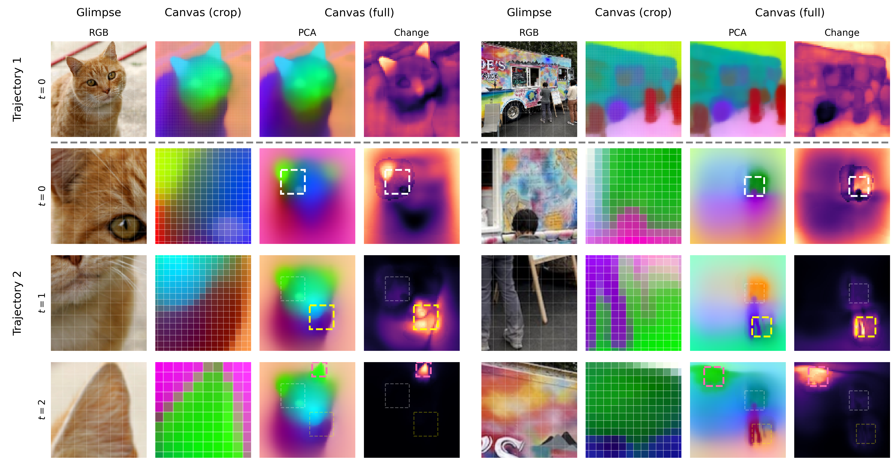

# CanViT (Canvas Vision Transformer) -- PyTorch

<p align="center">
  
</p>

**Yohaï-Eliel Berreby, Sabrina Du, Audrey Durand, Suresh Krishna**

Reference PyTorch implementation of CanViT (Canvas Vision Transformer).

_This is an early release. For details, a preprint version of our manuscript "CanViT: Toward Active Vision Foundation Models" will be available in the coming weeks._

---

CanViT is a scalable recurrent architecture for fine-grained vision, and the first **Active Vision Foundation Model (AVFM)**: a foundation model for active vision that is both task-agnostic and policy-agnostic.

CanViT processes scenes through sequences of localized glimpses, integrating observations over time into a persistent scene-wide latent workspace — the **canvas** — via **Canvas Attention**, an efficient asymmetric cross-attention mechanism which is based on Scene-Relative Rotary Position Embeddings and eliminates canvas-side QKVO projections.

CanViT-B is pretrained on 1 billion glimpses taken from 13.5 million ImageNet-21k scenes, via **policy-agnostic passive-to-active dense distillation** from a frozen high-resolution DINOv3 ViT-B teacher, without human annotations.

CanViT's scene-wide output features at each timestep are linearly decodable into dense predictions without post-hoc upscaling; a frozen-weights CanViT-B evaluated with linear probing outperforms all prior dense active vision models by a wide margin on ADE20K scene parsing, at a fraction of the cost, while offering significantly greater flexibility.

CanViT generalizes natively across policies, sequence length, glimpse size and canvas size, enabling high-resolution and long-horizon continual pretraining alongside task-specific policy learning.

CanViT enables low-latency high-resolution dense vision, running at hundreds of sequential frames per second on commodity hardware.

## Quickstart

We recommend [`uv`](https://docs.astral.sh/uv/) for dependency management.

```bash
uv add canvit-pytorch
```

```python
from canvit_pytorch import CanViTForPretrainingHFHub, Viewpoint, sample_at_viewpoint
from canvit_pytorch.preprocess import preprocess
from PIL import Image
import torch

# CanViT is integrated with the HuggingFace Hub.
model = CanViTForPretrainingHFHub.from_pretrained(
    "canvit/canvitb16-add-vpe-pretrain-g128px-s512px-in21k-dv3b16-2026-02-02"
).eval()

# Replace with the image of your choice
image = Image.open("test_data/Cat03.jpg").convert("RGB")
image = preprocess(512)(image)
image = image.unsqueeze(0)  # [1, 3, 512, 512]

# CanViT is a recurrent model.
state = model.init_state(batch_size=1, canvas_grid_size=32)

# Let's process a first glimpse: centered, zoomed-out.
# You can use any viewpoint you like, as long as it is within bounds.
# CanViT was trained on viewpoints covering 0.25% to 100%
# of a scene's surface area.
with torch.inference_mode():
    vp = Viewpoint.full_scene(batch_size=1, device=image.device)
    glimpse = sample_at_viewpoint(spatial=image, viewpoint=vp, glimpse_size_px=128)
    out = model(glimpse=glimpse, state=state, viewpoint=vp)

# Let's inspect the structure of what we get back.
# The canvas contains the model's working understanding of
# the scene at any given time, and is linearly decodable 
# into dense predictions upon token-wise LayerNorm.
# See `demos/basic.py` for how to visualize the canvas.
canvas_spatial = model.get_spatial(out.state.canvas)  # [1, 1024, 1024]
canvas_spatial = canvas_spatial.unflatten(1, (32, 32))  # [1, 32, 32, 1024] — spatial feature map
out.state.recurrent_cls  # [1, 1, 768] — global CLS token
out.local_patches        # [1, 64, 768] — glimpse patch features

# Now let's do a second glimpse: zoom into the top-left quadrant
# You can do this repeatedly: CanViT is recurrent with a large but constant-size canvas.
with torch.inference_mode():
    vp2 = Viewpoint(centers=torch.tensor([[-.5, -.5]]), scales=torch.tensor([.5]))
    glimpse2 = sample_at_viewpoint(spatial=image, viewpoint=vp2, glimpse_size_px=128)
    out2 = model(glimpse=glimpse2, state=out.state, viewpoint=vp2)
    
# You can use CanViT with frozen weights, fine-tune it, learn a policy on top...
# Or pretrain your own; it's fast.
# Start building!
```

For a full demo with classification and PCA visualization:

```bash
git clone https://github.com/m2b3/CanViT-PyTorch.git
cd CanViT-PyTorch
uv run --extra demo python demos/basic.py
```

## Pretrained checkpoints

We release checkpoints on HuggingFace under the [`canvit`](https://huggingface.co/canvit) namespace.

The following checkpoints are currently available:

- [`canvit/canvitb16-add-vpe-pretrain-g128px-s512px-in21k-dv3b16-2026-02-02`](https://huggingface.co/canvit/canvitb16-add-vpe-pretrain-g128px-s512px-in21k-dv3b16-2026-02-02)


## Citation

If you use this work, please cite this repository.
An updated citation will be available upon preprint release.

```bibtex
@misc{berreby2026canvit,
  title={CanViT: Toward Active Vision Foundation Models},
  author={Berreby, Yoha{\"i}-Eliel and Du, Sabrina and Durand, Audrey and Krishna, Suresh},
  year={2026},
  howpublished={\url{https://github.com/m2b3/CanViT-PyTorch}}
}
```

## Contact 

Open an issue in this repository or email me@yberreby.com.

## License

MIT. See [LICENSE.md](LICENSE.md) for details.
